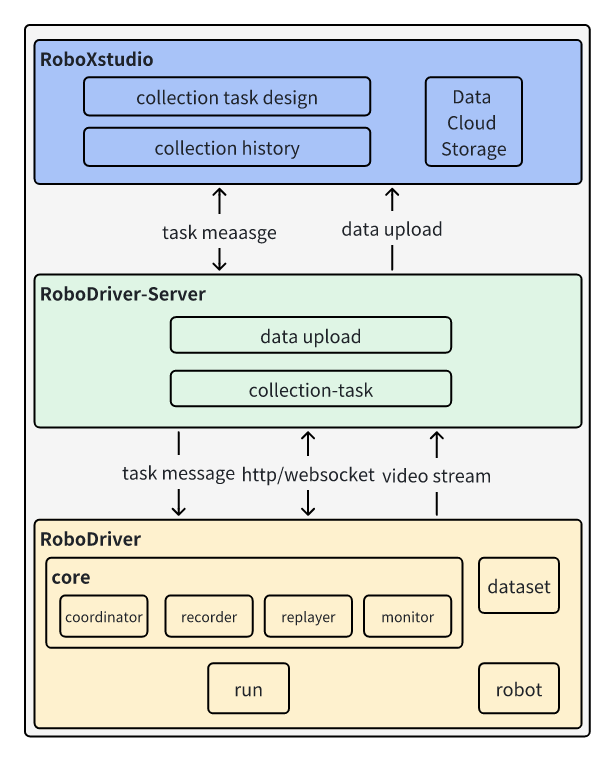

# 🎉 欢迎安装 RoboDriver-Server 及配套服务！
<p align="center">
  
</p>

为快速部署并使用 RoboDriver-Server，以下为**智源研究院内部开发者** 提供专属部署指南，**外部使用者**请切换到main分支，按需选择操作即可高效完成配置：

---

## 👨💻 智源研究院内部开发者部署指南
具身一体化平台：https://ei2rmd.baai.ac.cn

### 🚀 核心部署流程
#### 1. 克隆源码仓库,执行一键安装脚本
```bash
git clone https://github.com/FlagOpen/RoboDriver-Server.git
cd ./RoboDriver-Server/
git checkout baai
cd ./setup
bash ./setup.bash
```

#### 2. 跟随脚本完成专属配置
运行脚本后，按提示完成以下配置（其余流程自动执行）：
1. 输入机器人类型（支持 aloha/pika/realman 等预定义类型，也可自定义）；
2. 确认或输入当前用户名（将自动同步到数据集存储路径 `/home/$CURRENT_USER/DoRobot/dataset/`）；
3. 选择是否安装 Docker：
   - 安装 Docker：可选择从本地加载镜像或者从 Docker Hub 拉取镜像，并启动 RoboDriver-Server 容器；
   - 不安装 Docker：需后续手动完成运行环境部署（详见下方「环境部署」步骤）；
4. **开发者专属：选择数据上传方式**：
   - `nas`：内部私有 NAS 存储；
   - `ks3`：对象存储；
   （注：上传方式选择后将自动写入 `setup.yaml`，后续可手动修改）。
5. 默认运行production环境，如需切换成dev\stage环境等，联系开发人员。

#### 3. 访问专属平台地址
- 本地采集平台：`http://localhost:5805/hmi`；

### 🛠️ 开发者补充操作指南
#### （一）上传配置精细化调整
内部开发者可通过 `setup.yaml` 灵活配置上传规则，核心参数说明如下（含专属配置）：
```yaml
# 机器人类型配置
robot_type: franka  # 脚本自动设置，可手动修改
# 服务端地址配置（内部专属）
device_server_ip: http://localhost:8088 
device_server_port: 8088  # 默认端口
# 上传开关与模式（支持GPU加速）
is_upload: True  # 是否开启自动上传
upload_immadiately_gpu: False  # 开启GPU实时编码上传（需NVIDIA显卡）
is_collect_upload_at_sametime: False  # 采集与上传异步执行（GPU编码时需设为True）
# 开发者专属：上传类型（二选一）
upload_type: nas  # 已通过脚本选择，支持手动修改为 ks3
# 上传时间配置
upload_time: '20:00'  # 定时上传时间（仅is_upload=True时生效）
# 数据集存储路径（自动同步当前用户名）
device_data_path: /home/$CURRENT_USER/DoRobot/dataset/
```

#### （二）上传方式切换说明
1. 从 NAS 切换到 KS3：
   ```bash
   # 编辑对应架构的配置文件（以x86为例）
   vi /opt/RoboDriver-Server/x86/setup.yaml
   # 修改 upload_type 为 ks3，保存退出
   upload_type: ks3
   ```
   # 重启服务（容器化部署）
   docker restart robodriver_server
   ```
   ```
   # 非容器化部署
   pkill -f operating_platform_server_test.py && python /opt/RoboDriver-Server/x86/operating_platform_server_test.py
   ```
2. 从 KS3 切换到 NAS：
   ```bash
   vi /opt/RoboDriver-Server/x86/setup.yaml
   upload_type: nas
   # 重启服务（同上）
   ```
（注：切换 NAS 上传时，需确保设备已接入内部局域网，且拥有 NAS 存储读写权限）。

#### （三）开发者专属功能
1. Logtail 日志采集（自动配置）：
   - 日志存储路径：`/opt/RoboDriver-log/log/server/`；
   - 支持日志自动上报至内部监控平台，便于问题排查和服务状态监控；

#### （四）容器化调试
```bash
# 进入对应架构目录（x86为例）
cd /opt/RoboDriver-Server/x86/
# 启动开发者调试容器（含开发依赖、调试工具）
bash debug_server_docker.sh
# 容器内启动服务（dev版本，开启调试日志）
python operating_platform_server_test.py
```

### ❌ 开发者问题排查
1. NAS 上传失败：检查设备是否接入内部局域网、NAS 权限是否过期，联系管理员重置权限；
2. 数据集路径权限问题：重新设置目录权限（脚本已自动配置，异常时手动执行）：
   ```bash
   sudo chown -R $USER:$USER /home/$CURRENT_USER/DoRobot/dataset/
   sudo chmod -R 777 /home/$CURRENT_USER/DoRobot/dataset/
   ```
3. 提示 `127.0.0.1:8088` 连接失败：RoboDriver-Server 服务未启动，需重新执行启动命令；
4. 访问 `http://localhost:5805/hmi` 失败：重启 Nginx 服务，命令：
   ```bash
   sudo systemctl restart nginx
   ```

---